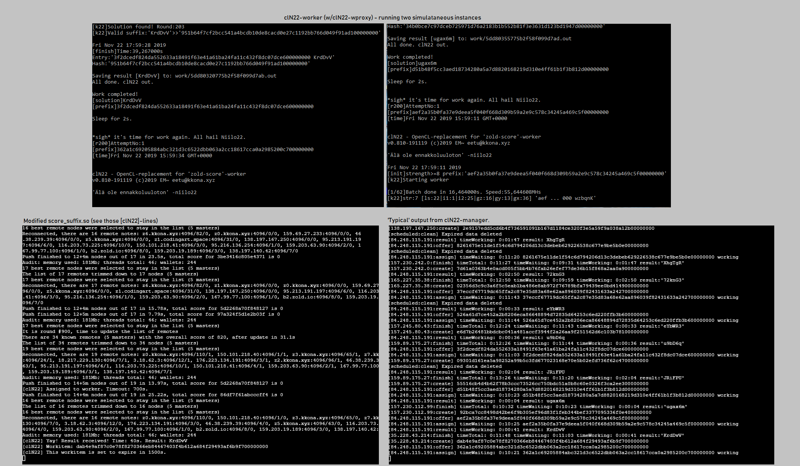

# clN22 - OpenCL accelerated '[zold-score](https://github.com/zold-io/zold-score)'-replacement

Experimental project aiming to outsource the very CPU intensive 'PoW'-workload of running [Zold](https://zold.io/)-node.
As whole, current operating scheme resembles traditional crypto mining pools. clN22-worker itself is highly portable and can (fairly easily) be used for other kinds of implementations.

##### clN22-worker      - OpenCL-zold-score grinder
###### 		-wproxy 	 - Connect to clN22-manager, fetch work, return solutions. Launches clN22-worker for processing. [srcNotUploaded]
######		-wTest		 - Compatibility/benchmark test [srcNotUploaded]
##### clN22-manager     - Simple RESTful API to manage workitems, nodes and workers. Receive new workitems, assign to workers, return results. [srcNotUploaded]
###### clN22-zoldscore   - Modified zold-score/ScoreSuffix.cpp. Interrupt program flow when requesting random nonce. Post prefix to clN22-manager and return valid result (or timeout).

