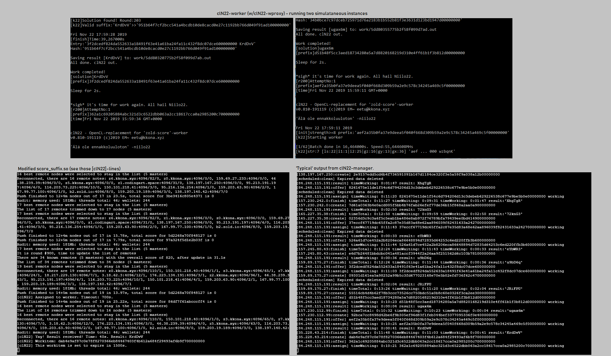

# clN22 - OpenCL accelerated '[zold-score/score_suffix](https://github.com/zold-io/zold-score)'-replacement

Experimental project aiming to outsource the very CPU intensive 'PoW'-workload of running [Zold](https://zold.io/)-node.
As whole, current operating scheme resembles traditional crypto mining pools. clN22-worker itself is highly portable and can (fairly easily) be used for other kinds of implementations.

##### clN22-worker        - OpenCL 'zold-score' worker. Prefix entered as input. Space separated, automatically adds 6-character suffix (a-z A-Z 0-9) and calculates sha256 hash of prefix+suffix. Goes through all possible suffices, until the resulting hash ends with a set  number (8) of trailing zeroes.
##### clN22-remoteclient  - Connect to clN22-manager, fetch work & return results.
##### clN22-manager       - Simple RESTful API to manage workitems, nodes and workers. Accept new workitems, assign to workers and return results.
##### clN22-zoldscore     - Modified zold-score/ScoreSuffix.cpp. Interrupt normal program flow when random suffix is called for. Post prefix to clN22-manager and return valid result (or timeout).

##### Building (more comprehensive guide to follow):
#### GCC works fine, other compilers should work as well.
#### Worker: Just link with OpenCL-library.
#### Remote client & 'zoldscore'-replacement: The 'cpr' & 'nlohmann/json' -libraries required.

